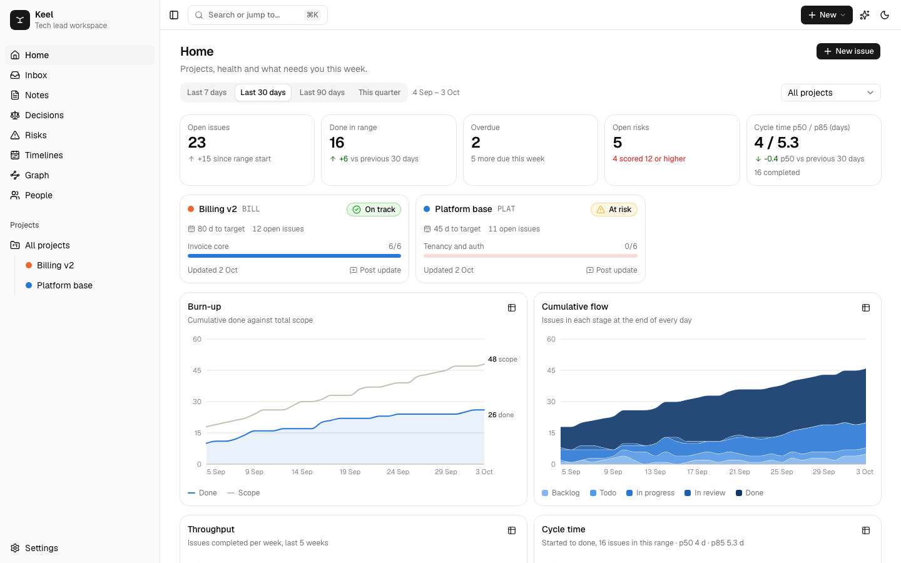
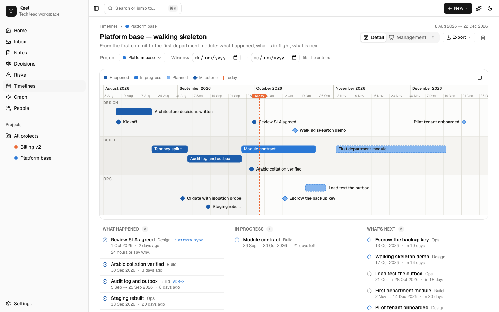
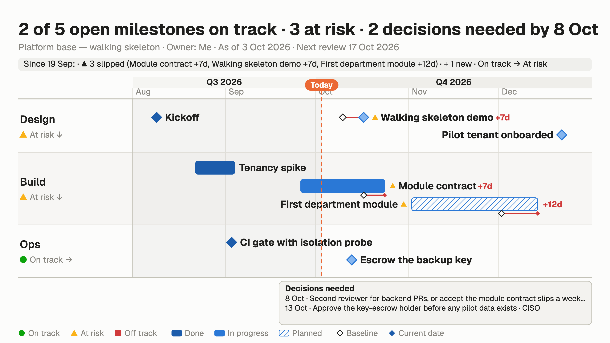
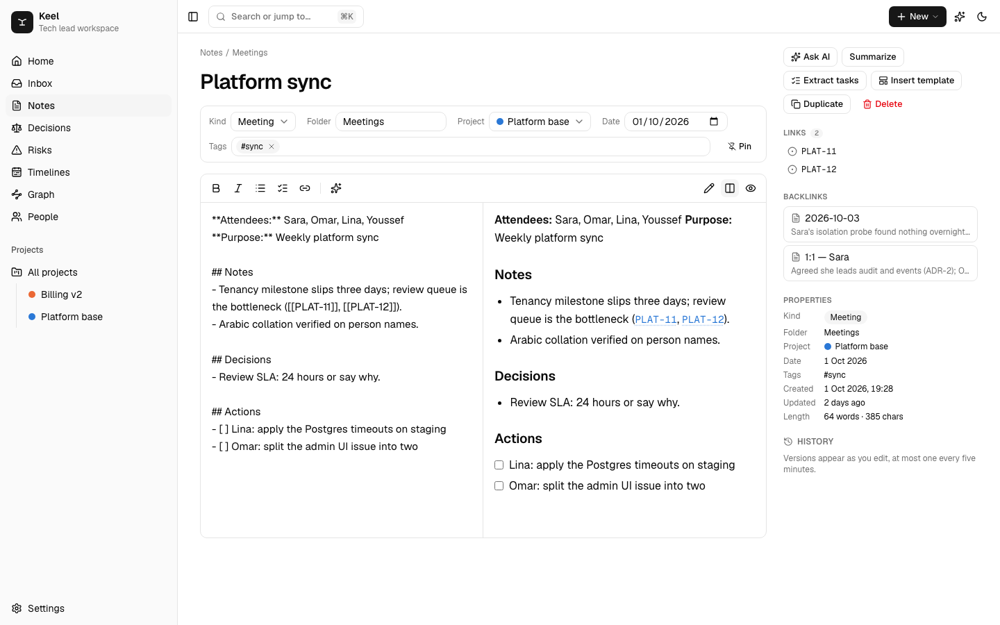
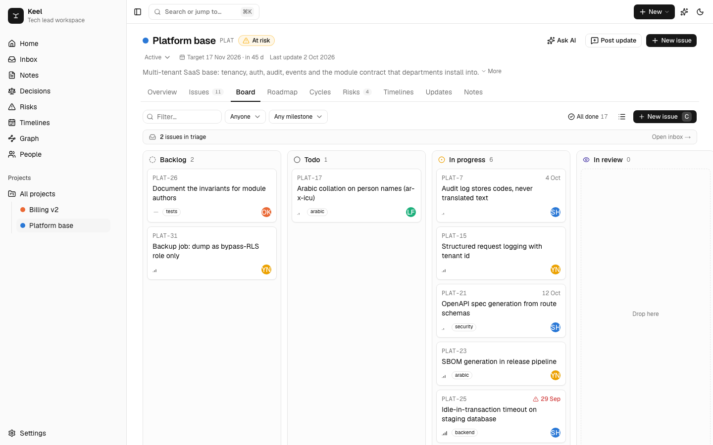
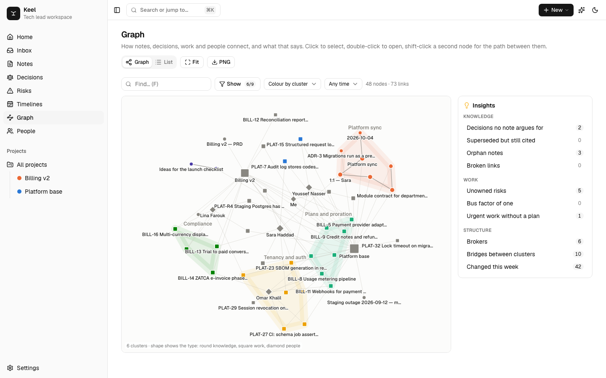

# Keel

**A local-first workspace for tech leads: notes, plans, decisions, risks, timelines and a dashboard, in one screen.**

[](https://github.com/ElAmir-Mansour/keel/actions/workflows/ci.yml)
[](LICENSE)
[](https://keel-six-amber.vercel.app)
[](.nvmrc)
[](package.json)

Keel is the workspace a tech lead or technical product manager actually needs: an Obsidian-style
vault of markdown notes, the projects and issues the team is working on, the decisions that were
made, the risks that are open, timelines you can put in front of management, and a handful of
charts that change what you do next. It runs entirely in your browser. Nothing leaves the device
unless you export it, configure sync, or ask the assistant a question with your own key.

**Live demo:** https://keel-six-amber.vercel.app — click **Load sample data** on the empty
dashboard to see every screen populated with eight weeks of realistic history.

## Screenshots

| Dashboard | Timeline |
|---|---|
|  |  |

| Management slide | Vault |
|---|---|
|  |  |

| Board | Graph |
|---|---|
|  |  |

## Why Keel

- **One place for the record.** Notes, issues, decisions and risks link to each other with
  `[[wikilinks]]`, so a decision cites the note that argued for it and the issue that shipped it.
- **Local-first, no account.** Data lives in your browser's IndexedDB. Export the whole workspace
  as one JSON file, import it anywhere, back it up to a folder, or sync through a Supabase project
  you own.
- **Charts that inform, not score.** Burn-up with a scope line, cumulative flow, cycle-time
  distribution, workload framed as capacity. No velocity, no vanity metrics.
- **Timelines a steering committee can read.** Type dated lines, get a to-scale chart, export a
  PDF handout or one 16:9 slide where status is computed from dates against a baseline.
- **An assistant that cites and asks.** Answers come with numbered citations; proposed actions
  are approved one by one before anything is written. Use Claude, GPT, Gemini, any
  OpenAI-compatible API, or a model on your own computer that needs no internet at all.
- **Arabic and English.** A right-to-left interface is a switch in Settings; notes mix both
  scripts cleanly.

## What it does

| Area | What you get |
|---|---|
| **Vault** | Markdown notes with `[[wikilinks]]`, backlinks, folders, tags, pinned notes, daily notes (`T`), templates for weekly updates, 1:1s, meetings, retros, PRDs, RFCs, runbooks and post-mortems. Version history per note (browse and restore). |
| **Graph** | The whole workspace as one map: notes, issues, decisions, projects, people, risks and tags, joined by wikilinks and by structure. Ten **insights** each answer one question on the graph (decisions no note argues for, superseded decisions still cited, orphan notes, broken links, unowned risks, bus factor of one, urgent work without a plan, brokers, bridges, this week's changes). Related work clusters into named regions. Select a node for its connections and a local graph at depth 1 to 3, shift-click another for the path between them, or switch to a sortable list. |
| **Plan** | Projects → milestones → issues. A triage **inbox** with single-key actions (`1` accept, `2` start, `3` decline, `h` snooze), a dense issue list, a kanban **board** with drag and drop, and a **roadmap** timeline of milestones. Paste a list, get one issue per line. |
| **Decisions** | A first-class decision log (ADR-lite): context, decision, consequences, alternatives, status, supersession. Link a decision from any note with `[[ADR-3]]`. |
| **Risks** | A RAID register per project and across projects, scored likelihood × impact, with a 5 × 5 matrix on the dashboard. |
| **Health** | A weekly project update — on track / at risk / off track — drafted from the week's activity in one click. |
| **Dashboard** | Burn-up with a scope line, cumulative flow, throughput, cycle-time distribution, milestone progress, workload by person (framed as capacity, not a scorecard). No velocity, no vanity. |
| **Timelines** | A timeline builder for "what happened and what comes next". Type dated lines (`2026-09-12: Kickoff`, `Sep 20 – Oct 3: Wireframes #Design`, `2026-12-01: !Launch [[PLAT-12]]`) or fill in rows, pull milestones, decisions and cycles from a project, and get a to-scale chart: lanes per category, bars for phases, diamonds for milestones, a today line, and a story of what happened, what is in progress and what is next. Export as a **PDF handout**, **PNG** (light or dark), **SVG**, or copy the image or the text. |
| **Management view** | The same timeline as one 16:9 slide for a steering meeting: the five to nine milestones you flag, lanes by theme with an on-track / at-risk / off-track verdict computed from dates against a baseline, slippage drawn as a hollow baseline diamond with a "+12d" label, a "since last review" strip from recorded reviews, and a box of decisions leadership owes with owners and dates. Status glyphs survive printing and colour blindness. Mirrors for an Arabic audience. |
| **Assistant** | Ask questions across the vault with numbered citations that link back to the note, issue or decision. Summarise a note, improve its writing, extract tasks, draft the weekly update. Ask it to *do* things and it proposes actions (create issues with points, log a decision, write a note, update an issue, add a risk, build or extend a timeline) that you approve one by one before anything is written. **Any provider:** Anthropic, OpenAI, Google Gemini, OpenRouter, Groq, Mistral, DeepSeek, xAI, any OpenAI-compatible endpoint, or **offline** with Ollama or LM Studio on your own machine. One key per provider, stored only in your browser. |
| **Points and KPIs** | Size issues on a scale you choose (Fibonacci, linear, powers of two or T-shirt). Points lock when work starts, are earned when the issue is done and taken back if it is reopened, and can be split between people. Give every person their own KPIs (points delivered, commitment kept, on-time delivery, cycle time, review wait, reopen rate, or a manual result) with targets, stretch goals and weights; an issue assigned to someone shows which of their KPIs it counts toward. A scorecard per month or quarter shows each KPI against target, the pace you would expect by today, a weighted score capped at 150%, and a ledger in which every adjustment and bonus has a written reason. Bonus tiers suggest extra points as drafts you approve. The People page lists everyone by name, never ranked. |
| **Cycles** | Optional fixed-length cycles per project. One active, one upcoming; when a cycle ends, unfinished work rolls forward on its own. Saved views keep your favourite filters one click away. |
| **GitHub** | Link pull requests and commits to issues by key, straight from the browser. Optionally let an opened PR move the issue to review and a merged PR close it, stamped with GitHub's own times. |
| **Weekly digest** | Once a week, on the day you choose, a digest note is written for every active project: health, what shipped, what is next, risks and asks. The assistant writes it when you have a key; otherwise it is drafted from the facts. |
| **Semantic search** | Optional, on-device: a small embedding model runs in the browser so search and the assistant find notes by meaning, in English or Arabic. |
| **Import** | Obsidian vaults, Linear CSV exports and Jira CSV exports, with a preview before anything is written. |
| **Install** | Installs as an app (PWA) and opens offline. Arabic interface with right-to-left layout is a switch in Settings. |

## Keyboard shortcuts

Everything is reachable from the keyboard: `⌘K` opens the palette (it shows every shortcut),
`C` new issue, `N` new note, `T` today's note, `A` ask the assistant, `G` then a letter to jump (`G L` for timelines).

## Why local-first

A tech lead's notes are the record of why things were decided. Keel keeps them in IndexedDB in
your browser, exports the whole workspace as one JSON file, and imports it back anywhere. There
is no account, no server database and no telemetry. Sync between devices is optional and runs
through a Supabase project you own; the data model was designed for it (string ids, ISO
timestamps, tombstoned deletes, no server-side generated fields).

The one feature that sends data off the device by default is the assistant, and it only sends the
context the panel shows you, only when you press send, and only with the key you pasted.

## Quick start

```bash
git clone https://github.com/ElAmir-Mansour/keel.git
cd keel
pnpm install
pnpm dev
```

Open http://localhost:3000, then **Load sample data** on the empty dashboard.

Requirements: Node 22+ (see `.nvmrc`), pnpm 11 (`corepack enable` picks the version from `package.json`).

### Run it on your own machine, permanently

Keel needs no server: the "server" only serves static files and the optional assistant route.
To keep a production build running locally:

```bash
pnpm local
```

That builds once and serves at http://localhost:3456. Your data stays in that browser profile,
so bookmark the address and keep using the same browser. On macOS, `scripts/macos-launch-agent.sh`
registers a login item that keeps it running. Pair it with **Automatic backups** in Settings,
which writes a JSON copy to a folder of your choice (a synced folder such as iCloud Drive or
Dropbox works well) on a schedule.

Set `KEEL_LOCAL_DIR` (see `.env.example`) to turn on the **local folder bridge**: Markdown files
under `<dir>/vault` become notes, JSON bundles under `<dir>/import` merge into the workspace, and
`<dir>/backups` is a ready target for automatic backups. The bridge routes answer only to
localhost, so a hosted deployment exposes no filesystem.

### Keep it safe: backups and sync

Everything lives in your browser's IndexedDB. Two optional layers protect it:

- **Automatic backups** (Settings → Automatic backups): pick a folder once; while Keel is open
  it writes `keel-backup-<date>.json` on a schedule and keeps the newest copies. Chrome and
  Edge only, because it uses the File System Access API; other browsers get a reminder and
  the manual export.
- **Sync across devices** (Settings → Sync): bring your own [Supabase](https://supabase.com)
  project. Run [`supabase/schema.sql`](supabase/schema.sql) once in its SQL editor, enable
  email sign-in, paste the project URL and anon key into Keel, and sign in with a magic link.
  Each device keeps working offline and merges when online: last write wins per record, and
  deletes travel too. Nothing is shared with anyone else; row-level security scopes every row
  to your user. A self-hosted Supabase works over https; a plain-http one needs its origin added to
  `connect-src` in `next.config.ts`.

### Bring your data with you

Settings → Import reads an **Obsidian vault** (any folder of Markdown files; front-matter becomes
properties, `[[links]]` keep working), a **Linear** CSV export (teams become projects, Linear
projects become milestones) or a **Jira** CSV export (sprints or parents become milestones). You
see a preview before anything is written.

## Use a model on your own computer

Keel's assistant works with no internet when the model runs locally.

1. Install [Ollama](https://ollama.com/download) and pull a model that supports tools:
   `ollama pull llama3.1` (or `qwen3`, `gemma3`). LM Studio works too: load a model and start its
   server on port 1234.
2. In Keel, open **Settings → AI assistant**, choose **Ollama** or **LM Studio**, press
   **Load models**, pick one and press **Test connection**.
3. If you use Keel from the web rather than `pnpm local`, allow the site in Ollama with
   `OLLAMA_ORIGINS=https://your-keel-domain ollama serve` (LM Studio: turn on *Enable CORS*).
   Chrome asks once to let the site reach your local network.

Set `OLLAMA_CONTEXT_LENGTH=16384` (or more) so long notes are not cut short.

## Deploy your own

[](https://vercel.com/new/clone?repository-url=https://github.com/ElAmir-Mansour/keel)

Keel is a plain Next.js app. On Vercel, import the repository and deploy; no environment
variables are needed. To let visitors use the assistant with **your** key instead of their own,
set the provider's key (`ANTHROPIC_API_KEY`, `OPENAI_API_KEY`, `GEMINI_API_KEY`, `OPENROUTER_API_KEY`,
`GROQ_API_KEY`, `MISTRAL_API_KEY`, `DEEPSEEK_API_KEY` or `XAI_API_KEY`) and `KEEL_ALLOW_SERVER_KEY=true` — leave the second unset on a public
deployment, or strangers will spend your credits. Leave `KEEL_LOCAL_DIR` unset on any hosted
deployment.

## Privacy and data

- **Storage.** Every note, issue, decision, risk, timeline and setting is stored in your browser's
  IndexedDB. Preferences such as language, and any keys you paste, are in `localStorage`. There is
  no account, no server database and no analytics or telemetry.
- **Assistant.** The provider, key and model you choose are stored in the browser, one key per
  provider. For cloud providers the request goes through Keel's single API route, which forwards
  that one request to the provider you picked and streams the reply back, or, if you choose
  *Directly from this browser*, your browser calls the provider itself. The route never stores or
  logs the key or the conversation, and it never calls an address your browser chose, except a
  local model when Keel itself runs on your machine. With Ollama or LM Studio nothing leaves your
  computer. Only the context shown in the panel is sent, and only when you press send.
- **Points and KPIs.** Stored with the rest of the workspace in IndexedDB. Earned points are
  derived from issue history on every read; only adjustments and bonuses are stored, each with a
  reason, and decided entries are never deleted.
- **Sync.** Off until you configure it. When on, records go to the Supabase project you created,
  under your own sign-in, scoped by row-level security.
- **GitHub.** Off until you configure it. When on, the browser calls GitHub's API for the
  repositories you list, with the optional token you provide, which stays in `localStorage`.
- **Semantic search.** Off until you switch it on. When on, the embedding library and model are
  downloaded from a CDN once and run entirely in the browser; your text never leaves the device.
- **Backups and import.** Read and write only the folder or files you pick.
- **Local folder bridge.** Only active when `KEEL_LOCAL_DIR` is set, and only for requests from
  localhost.

## Scripts

| Script | What it does |
|---|---|
| `pnpm dev` | development server |
| `pnpm build` / `pnpm start` | production build and server |
| `pnpm lint` | ESLint |
| `pnpm typecheck` | TypeScript, no emit |
| `pnpm test` | unit tests (Vitest) |
| `pnpm test:e2e` | end-to-end tests (Playwright) against a production build — run `pnpm build` first |
| `pnpm local` | build once and serve on :3456 |

## How it is built

- **Next.js 16** (App Router) and **React 19**, TypeScript strict.
- **Dexie 4** on IndexedDB; every screen is a live query, so edits appear everywhere at once.
- **shadcn/ui** (Radix, Tailwind v4, RTL enabled), **cmdk** for the palette, **@dnd-kit** for the board.
- **react-markdown** with GFM and a hand-rolled `[[` completion; `dir="auto"` so Arabic and
  English mix cleanly in the same note.
- **Recharts 3** with a validated colour-blind-safe palette in light and dark.
- **@anthropic-ai/sdk** behind a single streaming route handler.
- Timeline charts are plain SVG; export to PNG, SVG and PDF needs no library.

The data model, write rules and metrics live in `src/lib/`. All writes go through `repo.ts`;
pages only read. `metrics.ts` is pure functions from records to chart series. The research behind
the feature choices is in [`docs/RESEARCH.md`](docs/RESEARCH.md).

## Roadmap

- Shared workspaces with sign-in for a whole team.
- Notes as Markdown files on disk, so an Obsidian vault can be opened in place.
- Mobile capture: quick notes and issues from the home screen shortcut.

## Contributing

Bug reports and pull requests are welcome. Read [CONTRIBUTING.md](CONTRIBUTING.md) for setup,
scripts and the conventions the code follows, and the [Code of Conduct](CODE_OF_CONDUCT.md).
Changes are listed in [CHANGELOG.md](CHANGELOG.md).

## Security

Report vulnerabilities privately through the repository's **Security** tab rather than in a
public issue. [SECURITY.md](SECURITY.md) describes the trust model: what stays in the browser,
what the assistant route does with your key, and how the local folder bridge is scoped.

## Licence

MIT. Built by [ElAmir Mansour](https://github.com/ElAmir-Mansour).
